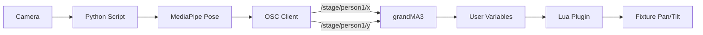

# OSC Person Tracking System for grandMA3

A real-time person tracking system that uses computer vision (MediaPipe) to track people and control grandMA3 lighting fixtures via OSC.

## 🎯 System Overview



**Flow:**
1. Camera captures video feed
2. MediaPipe detects person's pose and extracts nose position
3. Coordinates are normalized (0.0-1.0) and sent via OSC
4. grandMA3 receives OSC and writes to user variables
5. Lua plugin reads variables and controls fixture

## 📋 Requirements

### Python Side
- Python 3.8 or higher
- Webcam or camera device
- Network connection to grandMA3 console

### grandMA3 Side
- grandMA3 onPC or console (v1.8+)
- Moving head fixture(s) with Pan/Tilt
- OSC input enabled

## 🚀 Installation

### Step 1: Python Setup

1. **Install Python dependencies:**
   ```bash
   pip install -r requirements.txt
   ```

2. **Test the camera:**
   ```bash
   python person_tracker_osc.py --ip 127.0.0.1 --port 8000
   ```
   
   You should see a window with your camera feed. Press `Q` to quit.

### Step 2: grandMA3 OSC Configuration

1. **Enable OSC Input:**
   - Open grandMA3
   - Go to `Menu → In & Out → OSC`
   - Enable OSC Input
   - Set Port to `8000`

2. **Create User Variables:**
   - Open `Menu → Show → User Variables`
   - Create two variables:
     - Name: `TrackingX`, Type: `Float`, Range: `0-100`
     - Name: `TrackingY`, Type: `Float`, Range: `0-100`

3. **Configure OSC Input Mapping:**
   - Go to `Menu → In & Out → OSC → Input Configuration`
   - Add new OSC input:
     - **Address:** `/stage/person1/x`
     - **Target:** `UserVariable "TrackingX"`
     - **Range:** `0.0-1.0` → `0-100`
   - Add second input:
     - **Address:** `/stage/person1/y`
     - **Target:** `UserVariable "TrackingY"`
     - **Range:** `0.0-1.0` → `0-100`

### Step 3: Install Lua Plugin

1. **Copy plugin to grandMA3:**
   - Copy `TrackingPlugin.lua` to your grandMA3 plugins folder:
     - **Windows:** `C:\ProgramData\MALightingTechnology\gma3_<version>\plugins\`
     - **macOS:** `~/MALightingTechnology/gma3_<version>/plugins/`

2. **Load plugin in MA3:**
   - Open `Menu → Plugins`
   - Find `TrackingPlugin` in the list
   - Click to start the plugin

3. **Configure plugin (optional):**
   - Edit `TrackingPlugin.lua` to adjust:
     - `FIXTURE_ID`: Change from 101 to your fixture ID
     - `PAN_MIN/MAX`: Adjust for your fixture's range
     - `TILT_MIN/MAX`: Adjust for your fixture's range
     - `UPDATE_RATE`: Adjust tracking speed (default 20 Hz)
     - `SMOOTHING`: Adjust movement smoothing (0-1)

## 🎮 Usage

### Basic Usage

1. **Start the Python tracker:**
   ```bash
   python person_tracker_osc.py --ip <MA3_IP> --port 8000
   ```
   
   Replace `<MA3_IP>` with your grandMA3 console's IP address.

2. **Start the MA3 plugin:**
   - In grandMA3, go to `Menu → Plugins`
   - Start `TrackingPlugin`

3. **Stand in front of the camera:**
   - The fixture should now follow your movement!

### Command Line Options

```bash
python person_tracker_osc.py [OPTIONS]

Options:
  --ip IP         IP address of grandMA3 console (default: 127.0.0.1)
  --port PORT     OSC port (default: 8000)
  --camera ID     Camera device ID (default: 0)
```

**Examples:**
```bash
# Connect to MA3 at 192.168.1.100
python person_tracker_osc.py --ip 192.168.1.100

# Use external USB camera (device 1)
python person_tracker_osc.py --camera 1

# Full configuration
python person_tracker_osc.py --ip 192.168.1.100 --port 8000 --camera 0
```

## 🎛️ Configuration

### Python Script Configuration

Edit `person_tracker_osc.py` to adjust:

- **Detection confidence:** Line 25-26
  ```python
  min_detection_confidence=0.5,  # Lower = more sensitive
  min_tracking_confidence=0.5,   # Lower = more tracking
  ```

- **Camera resolution:** Line 40-41
  ```python
  self.cap.set(cv2.CAP_PROP_FRAME_WIDTH, 1280)
  self.cap.set(cv2.CAP_PROP_FRAME_HEIGHT, 720)
  ```

### Lua Plugin Configuration

Edit `TrackingPlugin.lua` CONFIG table (lines 19-27):

```lua
local CONFIG = {
    FIXTURE_ID = 101,           -- Your fixture ID
    UPDATE_RATE = 0.05,         -- 20 Hz (0.05s between updates)
    PAN_MIN = 0,                -- Pan range start
    PAN_MAX = 540,              -- Pan range end
    TILT_MIN = 0,               -- Tilt range start
    TILT_MAX = 270,             -- Tilt range end
    INVERT_TILT = true,         -- Invert Y axis
    SMOOTHING = 0.2,            -- Smoothing (0-1)
}
```

## 🔧 Troubleshooting

### Python Issues

**Problem:** `Cannot open camera`
- **Solution:** Check camera is connected and not in use by another app
- Try different camera ID: `--camera 1` or `--camera 2`

**Problem:** `No person detected`
- **Solution:** 
  - Ensure good lighting
  - Stand further from camera
  - Lower detection confidence in code

**Problem:** `OSC connection failed`
- **Solution:**
  - Verify MA3 IP address is correct
  - Check firewall settings
  - Ensure MA3 OSC input is enabled

### grandMA3 Issues

**Problem:** Variables not updating
- **Solution:**
  - Check OSC input is enabled
  - Verify OSC port matches (8000)
  - Check OSC input mapping configuration
  - Monitor variables in `User Variables` window

**Problem:** Fixture not moving
- **Solution:**
  - Verify fixture ID in plugin matches your fixture
  - Check fixture is patched and has intensity
  - Ensure fixture is not in another programmer or cue
  - Check Pan/Tilt ranges match your fixture

**Problem:** Plugin won't start
- **Solution:**
  - Check plugin file is in correct folder
  - Look for syntax errors in Command Line Feedback
  - Restart grandMA3 software

### Performance Issues

**Problem:** Laggy/jerky movement
- **Solution:**
  - Increase `SMOOTHING` in Lua plugin (0.3-0.5)
  - Reduce `UPDATE_RATE` (try 0.1 for 10 Hz)
  - Close other applications using camera

**Problem:** Tracking jumps around
- **Solution:**
  - Increase smoothing
  - Improve lighting conditions
  - Increase tracking confidence in Python script

## 📊 Technical Details

### Coordinate System

- **Python Output:** 0.0 to 1.0 (normalized)
  - X: 0.0 = left, 1.0 = right
  - Y: 0.0 = top, 1.0 = bottom

- **OSC Messages:** Float values 0.0-1.0
  - `/stage/person1/x`: Horizontal position
  - `/stage/person1/y`: Vertical position

- **MA3 Variables:** 0-100
  - `$TrackingX`: 0 = left, 100 = right
  - `$TrackingY`: 0 = top, 100 = bottom

- **Fixture Control:** Degrees
  - Pan: 0-540° (configurable)
  - Tilt: 0-270° (configurable, inverted)

### Tracking Point

The system tracks the **nose landmark** from MediaPipe Pose. This provides:
- Stable tracking point
- Good representation of person's position
- Works well for stage positioning

To track a different point, edit `person_tracker_osc.py` line 72:
```python
# Options: NOSE, LEFT_HIP, RIGHT_HIP, etc.
nose = landmarks.landmark[self.mp_pose.PoseLandmark.NOSE]
```

## 🎨 Customization Ideas

### Multiple Fixtures
Modify the Lua plugin to control multiple fixtures:
```lua
for i = 101, 104 do
    Cmd(string.format('Fixture %d At Pan %.2f', i, targetPan))
    Cmd(string.format('Fixture %d At Tilt %.2f', i, targetTilt))
end
```

### Multiple People
Extend Python script to track multiple people and send to different OSC addresses:
- `/stage/person1/x`, `/stage/person1/y`
- `/stage/person2/x`, `/stage/person2/y`

### Add Intensity Control
Track distance from camera and control intensity:
```lua
-- In Lua plugin
local distance = getUserVar("TrackingDistance")
local intensity = mapRange(distance, 0, 100, 0, 100)
Cmd(string.format('Fixture %d At %.2f', CONFIG.FIXTURE_ID, intensity))
```

## 📝 License

This project is provided as-is for use with grandMA3 lighting control systems.

## 🤝 Support

For issues or questions:
1. Check the troubleshooting section above
2. Verify all configuration steps were followed
3. Check grandMA3 Command Line Feedback for errors
4. Monitor Python console output for error messages

---

**Happy Tracking! 🎭✨**
